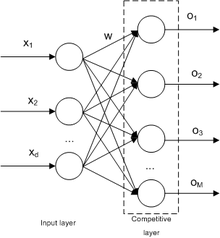
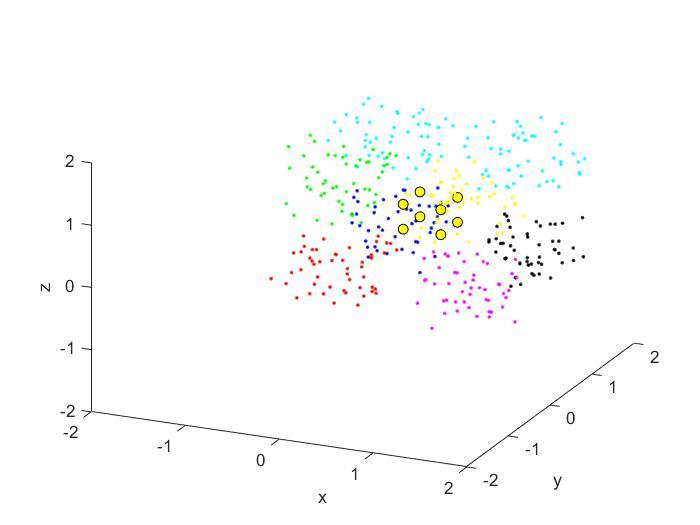
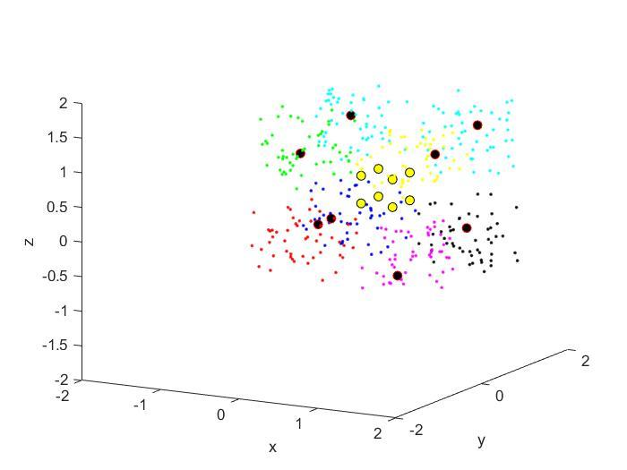

# Competitive Neural Networks (CLNN) — 3D Data Clustering in MATLAB

A MATLAB implementation of a **competitive (winner-take-all) neural network** that groups
randomly generated three-dimensional data into eight clusters. Lateral interaction between
neurons is modelled with a **Mexican hat ("sombrero") function**, and the training progress
is animated in a 3D scatter plot.

> **Original implementation notice**
> This repository preserves the original implementation of the project. The source code has
> intentionally not been refactored or modernized in order to retain the historical context and
> original development approach. The source code represents the original implementation
> developed during my university studies.

---

## Project Overview

The program generates 400 random points in 3D space (8 groups × 50 points, one group per
octant around the point `(0.5, 0.5, 0.5)`), places 8 neurons close to the centre of the data,
and trains them with a competitive learning rule: for every sample, only the neuron with the
highest activation (the *winner*) moves its weights toward the sample. After training, each
neuron ends up representing one group of data.

## Project Context

| Item | Value | Evidence |
|---|---|---|
| Project type | **Academic / University Project — Coursework (lab practice)** | Confirmed |
| Institution | Universidad de Guadalajara | Confirmed — report header |
| Author | Omar Baruch Morón López | Confirmed — report header |
| Activity | Lab practice ("práctica"), most likely *Práctica 4* | Inferred — the report was originally committed as `practica4.pdf` |
| Course | Not stated; the topic suggests a neural networks / artificial intelligence course | Inferred |
| Date | Report created 8 November 2019; uploaded to GitHub on 30 September 2023 | Confirmed — PDF metadata and git history |
| Language of the original material | Spanish | Confirmed |

See [docs/project-context.md](docs/project-context.md) for the full context reconstruction.

## Problem Statement

Given an unlabeled set of 3D points, divide it into groups (clusters) without supervision,
using a single-layer competitive neural network with one neuron per desired group.

## Objective

From the original report (translated): *"The objective of this practice is to divide a data
set into groups. To allow a visual representation of the problem, it will be done in 3
dimensions — 3 variables, or in neural terms, 3 inputs."*

The report also includes an **extra** goal: deriving an "ideal" learning coefficient from the
data so that neurons stay within the problem's range and do not diverge.

## Repository Structure

```
.
├── README.md                     # This file
├── src/                          # Original MATLAB source code (unchanged)
│   ├── competitive_neuronal_networks.m
│   └── sombrero_function.m
└── docs/
    ├── project-context.md        # Origin, scope and evidence of the project
    ├── report.md                 # English summary of the original PDF report
    ├── code-overview.md          # File-by-file explanation of the source code
    ├── possible-improvements.md  # Observations NOT applied to the code
    ├── sdlc/                     # Intent, specification and plan (reverse-engineered)
    │   ├── intent.md
    │   ├── spec.md
    │   └── plan.md
    ├── images/                   # Figures extracted from the original report
    └── original/
        └── documentation.pdf     # Original lab report (Spanish), unmodified
```

## Original Implementation

The files in [`src/`](src/) are byte-for-byte identical to the files originally uploaded.
They were only moved into `src/`; their content, variable names (in Spanish), comments,
typos and technical decisions have been kept as they were. Known issues and possible
improvements are documented separately in
[docs/possible-improvements.md](docs/possible-improvements.md) and were **not** applied.

## Technologies

- **MATLAB** — the only language used (`.m` scripts, `scatter3` plotting, `rand`, `randperm`).
- The main script defines local functions at the end of a script file, a feature introduced
  in MATLAB R2016b, so that release or newer is required (inferred from the syntax). The
  exact MATLAB version originally used is not documented.
- No toolboxes are required as far as can be determined from the code.

## How It Works

1. **Data generation** — 8 groups of 50 points each; every coordinate is `rand ± 0.7`, which
   places each group in a different octant around `(0.5, 0.5, 0.5)`.
2. **Shuffling** — the 400 points are randomly permuted (`mix` function).
3. **Learning rate** — computed from the data as the mean of the per-axis means
   (variable `Inteligencia`, ≈ 0.5 for this data set).
4. **Initialization** — 8 neurons placed at the corners of a small cube `[0.3, 0.7]³`, one
   per octant. Each neuron also has a fixed 1D "position" (`wd1 … wd8`) used for lateral
   interaction.
5. **Competition** — for each sample `x`, each neuron `j` computes
   `v_j = w_jᵀx − 0.5·w_jᵀw_j + Σ_k sombrero(|wd_j − wd_k|, a, b)`,
   with `sombrero(d) = (b − a·d²)·e^(−d²)`, `a = 0.01`, `b = 0.06`.
6. **Update (winner-take-all)** — only the winner moves:
   `w_win ← w_win + η·(x − w_win)`.
7. **Visualization** — after every sample the plot is redrawn: data points coloured by their
   generating group, initial neurons in yellow, current neurons in black.

A detailed walkthrough is in [docs/code-overview.md](docs/code-overview.md).

## Architecture

Single-layer competitive network: 3 inputs (x, y, z) fully connected to 8 competitive output
neurons.



*Figure taken from the original report.*

## Inputs and Outputs

- **Inputs:** none from files. All data is generated randomly at run time; the parameters are
  hard-coded at the top of the script (`Numero_deDatos`, `a`, `b`, `Generaciones`, `sep`).
- **Outputs:** an animated MATLAB 3D figure and the value of `Inteligencia` printed in the
  Command Window. Nothing is written to disk.

| Initial state | Final state |
|---|---|
|  |  |

*Results from the original report: yellow = initial neurons, black = final neurons.*

## Running the Project

Based on the code (not documented in the original material):

1. Open MATLAB (R2016b or newer).
2. Set `src/` as the current folder.
3. Run the script:

   ```matlab
   competitive_neuronal_networks
   ```

The script is self-contained: it defines its own `mix` and `sombrero` local functions, so
`sombrero_function.m` is not required to run it. Because the data is random and no seed is
set, each run produces a different result.

## Documentation

- [Project context](docs/project-context.md)
- [Original report summary (English)](docs/report.md)
- [Code overview](docs/code-overview.md)
- [Possible improvements (not applied)](docs/possible-improvements.md)
- [Intent](docs/sdlc/intent.md) · [Specification](docs/sdlc/spec.md) · [Plan](docs/sdlc/plan.md)
- [Original report (PDF, Spanish)](docs/original/documentation.pdf)

## Historical Note

This repository was later reorganized and documented to improve readability and preserve the
historical context of the original project. The original source code remains unchanged.

The lab report is dated November 2019 (the code itself carries no date); the project was uploaded to GitHub in
September 2023, its files were renamed to English names in March 2025, and the repository
structure and documentation were added afterwards.
