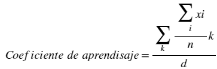

# Original Report — English Summary

Structured English summary of the original lab report
[`original/documentation.pdf`](original/documentation.pdf) (3 pages, Spanish, IEEE-style
two-column layout). This is not a literal translation; quotes are translated by the maintainer.
Text, formulas and figures were reviewed both by text extraction and visually.

- **Title:** *Redes Neuronales Competitivas ("CLNN")* — Competitive Neural Networks
- **Author:** Omar Baruch Morón López, Universidad de Guadalajara
- **Keywords:** neural network, artificial intelligence, competitiveness, clustering, multi-output

## Abstract

The practice explains what a competitive neural network is and implements one in MATLAB to solve
a clustering problem with 3-dimensional data and eight neurons (groups).

## I. Introduction

- In most neural networks, neurons *cooperate* to represent patterns. In competitive learning
  networks, each neuron *competes* with the others to represent a pattern.
- The neuron that best represents a pattern wins and "takes all" of the learning for that
  pattern. The goal is for groups (categories) of patterns to form, each represented by one
  neuron.
- When a pattern is presented, only one neuron activates.
- The report attributes this type of network to Rumelhart and Zipser (1985) and notes that it
  led to variants such as Kohonen networks, citing reference [1].

### Architecture

Competitive networks are single-layer, with one neuron per desired group:


*Figure 1 of the report: inputs x₁…x_d fully connected through weights W to a competitive layer
with outputs o₁…o_M.*

### Training rule (neuron activation)

As written in the report (the equation is partially garbled in the PDF; this is the readable
intent):

```
v = xᵀw − 0.5·(wᵀw) + Σ MexicanHat(neural distance between one neuron and all others)
```

### Weight update rule

Only the neuron with the highest output is updated:

```
w(new) = w(current) + η · (X(current) − w(current))
```

## II. Objective of the Practice

- Divide a data set into groups. Use 3 dimensions (3 variables / 3 network inputs) so the result
  can be visualized.
- For didactic purposes, generate a separate random data set in each of the 8 octants
  ("cuadrantes" in the report) and start one neuron per octant near the centre.
- Use the **Mexican hat function** for competition between neurons: it penalizes neurons far from
  the current neuron and helps the closer ones.
- Mexican hat coefficients: `a = 0.01`, `b = 0.06`, chosen small because the data and the problem
  stay below values of about 1.5.

## III. (Extra) Ideal Learning Coefficient

As an extra, the report proposes a way to obtain a learning coefficient that keeps neurons within
the problem's range and prevents divergence:



In words: for each dimension *k*, compute the mean of the data (Σᵢ xᵢ / n); combine the
per-dimension means and divide by the number of dimensions *d*. The implementation
(`Inteligencia = mean([mean(x), mean(y), mean(z)])`) computes the average of the per-axis means.
The extra factor *k* that appears in the rendered formula is not reflected in the code; whether
it is an index notation or a multiplier cannot be confirmed.

## IV. Results


*Illustration 1: scattered data and neurons in their initial position (yellow).*

For each sample, the winning neuron is computed and its weights are updated, so it moves toward
its group. This is repeated for the configured number of generations.


*Illustration 2: reorganized neurons. Yellow = initial neurons, coloured dots = data, black =
final neuron positions.*

## V. Conclusion

- Competitive networks are well suited for identifying patterns, clustering data and grouping
  results of combinations.
- They can organize data in 4, 5, 6 or more dimensions, which humans cannot visualize.
- Example proposed by the author: grouping the results of a chemistry experiment where a solution
  depends on the varying proportions of several compounds (the text mentions both 4 variables and
  5 compounds); the network could group the results and create new categories.

## VI. Code

The report includes a full listing of the MATLAB code. It matches
[`src/competitive_neuronal_networks.m`](../src/competitive_neuronal_networks.m) except that the
listing lacks the per-sample animation block. See
[project-context.md](project-context.md#contradictions-and-discrepancies).

## References (as in the report)

1. Alfonso Ballesteros, Computer Engineer, University of Málaga (Spain), final degree project
   supervised by D. Enrique Domínguez. Available at
   `http://www.redes-neuronales.com.es/tutorial-redes-neuronales/red-neuronal-competitiva-simple.htm`
   (availability of this URL today has not been verified).
